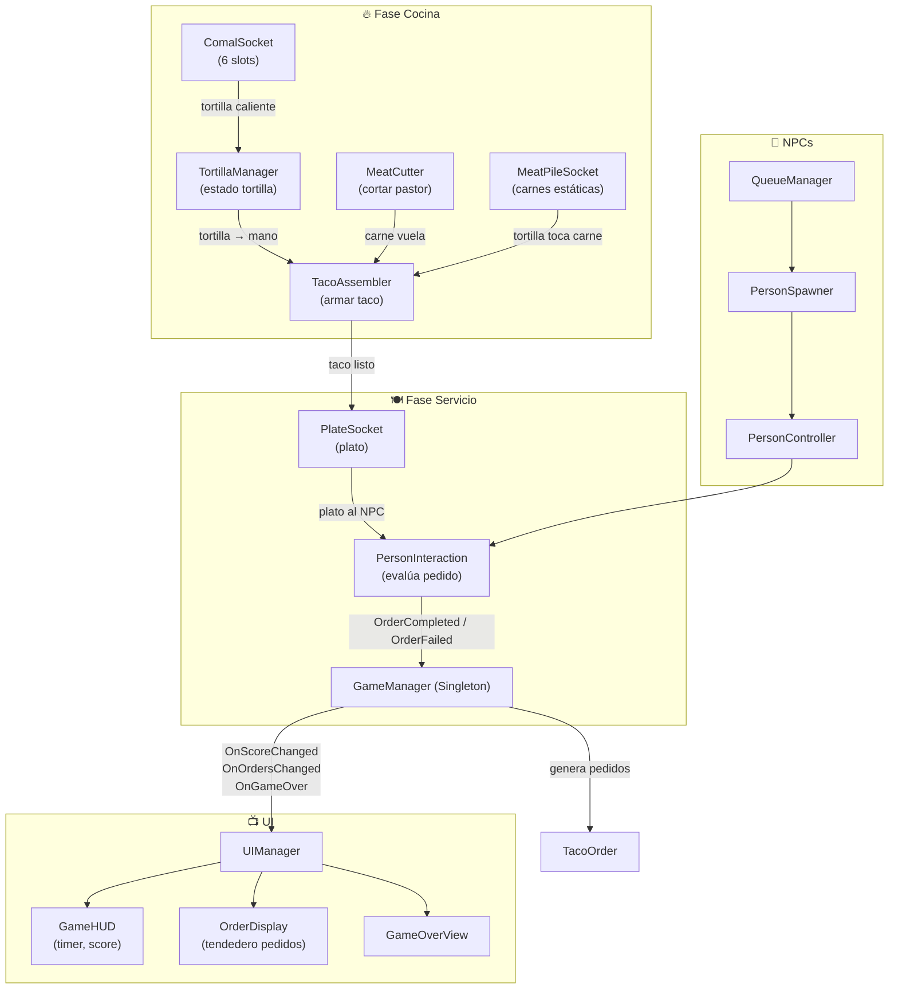
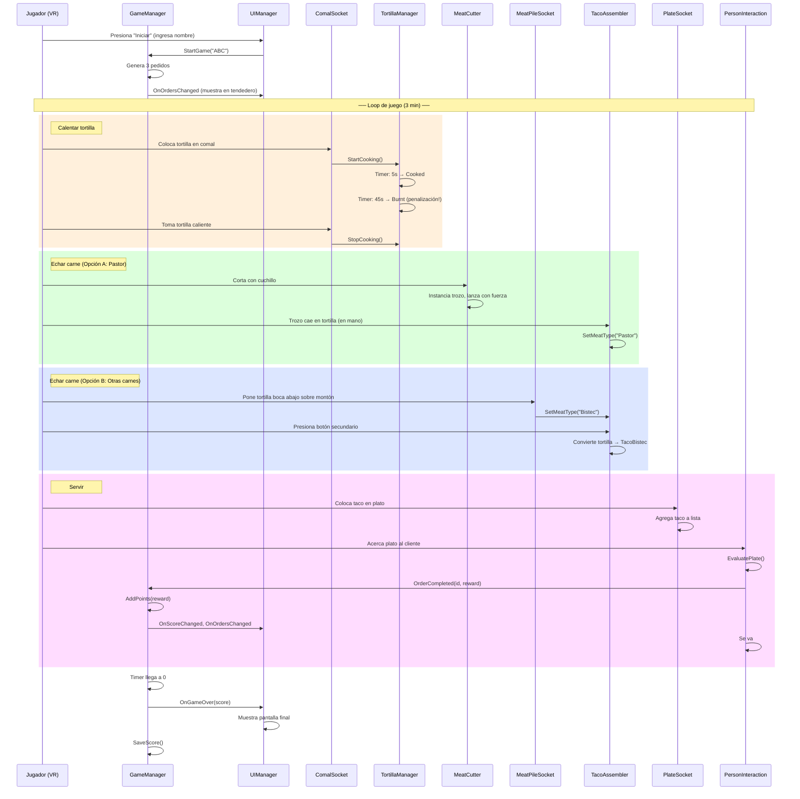

# 🌮 Plan de Implementación — Taquero Mamón VR

## Estado Actual del Proyecto

### Scripts Existentes
| Script | Ubicación | Función | Estado |
|---|---|---|---|
| [GameManager.cs](file:///c:/Unity%20projects/VR%20Project/Assets/PROYECTO/Scripts/GameManager.cs) | Scripts/ | Singleton, timer, score, pedidos | ✅ Completo |
| [TacoOrder.cs](file:///c:/Unity%20projects/VR%20Project/Assets/PROYECTO/Scripts/TacoOrder.cs) | Scripts/ | Data class de pedidos | ✅ Completo |
| [DroppableObject.cs](file:///c:/Unity%20projects/VR%20Project/Assets/PROYECTO/Scripts/DroppableObject.cs) | Scripts/ | Penalización al caer objetos | ✅ Completo |
| [MeatCutter.cs](file:///c:/Unity%20projects/VR%20Project/Assets/PROYECTO/Scripts/MeatCutter.cs) | Scripts/ | Cortar pastor con cuchillo | ⚠️ Necesita cambios |
| [Radio.cs](file:///c:/Unity%20projects/VR%20Project/Assets/PROYECTO/Scripts/Radio.cs) | Scripts/ | Música ambiental | ✅ Completo |
| [PersonController.cs](file:///c:/Unity%20projects/VR%20Project/Assets/PROYECTO/Prefabs/NPC/scripts/PersonController.cs) | NPC/scripts/ | Movimiento del NPC | ⚠️ Necesita integración |
| [PersonInteraction.cs](file:///c:/Unity%20projects/VR%20Project/Assets/PROYECTO/Prefabs/NPC/scripts/PersonInteraction.cs) | NPC/scripts/ | NPC detecta/agarra taco | ⚠️ Necesita reescritura |
| [PersonSpawner.cs](file:///c:/Unity%20projects/VR%20Project/Assets/PROYECTO/Prefabs/NPC/scripts/PersonSpawner.cs) | NPC/scripts/ | Spawn de NPCs | ⚠️ Necesita integración |
| [QueueManager.cs](file:///c:/Unity%20projects/VR%20Project/Assets/PROYECTO/Prefabs/NPC/scripts/QueueManager.cs) | NPC/scripts/ | Fila de 3 spots | ✅ Base ok |

### Prefabs Existentes
- **Interactables**: `Tortilla`, `Pastor`, `Bistec`, `Queso`, `Plato`, `Meat Cleaver`, `TacoPastor`, `TacoBistec`, `TacoQueso`, `TacoListo`, `Meat-material`
- **Estáticos**: `Cebolla`, `Cilantro`, `Limon`, salsas, bebidas
- **NPCs**: 3 modelos de personajes con animaciones (Walking, Sitting, Dancing, etc.)

---

## Arquitectura General



---

## Scripts a Crear / Modificar

### FASE 1 — Cocina (Tortillas y Cocción)

---

#### 1. `TortillaManager.cs` — NUEVO
> Se coloca en cada **prefab Tortilla**. Controla el ciclo de vida completo de la tortilla.

```
Ubicación: Assets/PROYECTO/Scripts/TortillaManager.cs
Se coloca en: Prefab Tortilla
```

**Inspector:**
| Campo | Tipo | Default | Descripción |
|---|---|---|---|
| `cookTime` | float | 5.0 | Segundos para que se caliente |
| `burnTime` | float | 45.0 | Segundos para que se queme (desde que empezó a calentar) |
| `rawMaterial` | Material | — | Material de tortilla cruda |
| `cookedMaterial` | Material | — | Material de tortilla caliente |
| `burntMaterial` | Material | — | Material de tortilla quemada |
| `burnPenalty` | int | 10 | Puntos que se restan si se quema |

**Enum TortillaState:**
```
Raw → Cooking → Cooked → Burnt
```

**Propiedades públicas:**
- `TortillaState CurrentState { get; }`
- `bool IsOnComal { get; }` — si está sobre el comal
- `bool IsCooked { get; }` — si está en estado "Cooked"
- `float CookProgress { get; }` — 0.0 a 1.0 progreso de cocción

**Métodos públicos:**
| Método | Trigger | Descripción |
|---|---|---|
| `void StartCooking()` | Llamado por `ComalSocket` cuando la tortilla entra al socket | Inicia el timer de cocción |
| `void StopCooking()` | Llamado por `ComalSocket` cuando la tortilla sale del socket | Pausa la cocción (si aún no está cooked) |

**Lógica en Update:**
1. Si `_state == Cooking`:
   - Incrementar `_cookTimer += Time.deltaTime`
   - Si `_cookTimer >= cookTime` y state es `Cooking` → transición a `Cooked`, cambiar material
   - Si `_cookTimer >= burnTime` → transición a `Burnt`, cambiar material, llamar `GameManager.Instance.ApplyPenalty(burnPenalty, "Tortilla quemada")`
2. Si `_state == Burnt`: la tortilla ya no sirve para nada

**Eventos:**
- `event Action<TortillaState> OnStateChanged` — para efectos visuales/sonidos

---

#### 2. `ComalSocket.cs` — NUEVO
> Se coloca en cada **slot del comal** (6 slots). Detecta cuando una tortilla entra o sale.

```
Ubicación: Assets/PROYECTO/Scripts/ComalSocket.cs
Se coloca en: 6 GameObjects vacíos posicionados sobre el comal (con trigger collider)
Requiere: Collider (trigger)
```

**Inspector:**
| Campo | Tipo | Default | Descripción |
|---|---|---|---|
| `tortillaTag` | string | "Tortilla" | Tag de las tortillas |

**Estado:**
- `_currentTortilla` — referencia a la TortillaManager que está en este slot (null si vacío)

**Métodos:**
| Método | Descripción |
|---|---|
| `OnTriggerEnter(Collider)` | Si el objeto tiene tag "Tortilla" y el slot está vacío → asignar, llamar `StartCooking()` |
| `OnTriggerExit(Collider)` | Si el objeto que sale es la tortilla actual → llamar `StopCooking()`, limpiar referencia |
| `bool IsOccupied()` | Retorna si hay tortilla en el slot |

> [!NOTE]
> Usar XR Socket Interactor de XRI sería lo ideal para los sockets del comal, pero este script complementa con la lógica de cocción. Si ya usas `XRSocketInteractor`, puedes suscribirte a sus eventos `selectEntered`/`selectExited` en vez de `OnTriggerEnter`/`OnTriggerExit`.

---

### FASE 2 — Carnes y Ensamblaje de Tacos

---

#### 3. `MeatCutter.cs` — MODIFICAR
> Ya existe. Necesita cambio para que la carne se lance **en la dirección normal del cuchillo** en vez de volar hacia la tortilla.

**Cambios necesarios:**

1. **Eliminar** `BuscarMejorTortilla()` y la corrutina `VolarEnCurva()`
2. **Nuevo comportamiento**: Al cortar, instanciar el trozo de pastor y aplicarle una fuerza (Rigidbody `AddForce`) basada en la **normal de contacto del cuchillo** (o la dirección `transform.forward` del cuchillo).
3. El trozo cae con física real y el jugador lo atrapa con la mano o cae en la tortilla.

**Nuevos campos Inspector:**
| Campo | Tipo | Default | Descripción |
|---|---|---|---|
| `fuerzaLanzamiento` | float | 3.0 | Fuerza con la que sale el trozo |
| `useKnifeNormal` | bool | true | Si true, usa la normal del cuchillo; si false, dirección aleatoria |

**Nuevo método `CortarYLanzar(Collider cuchillo)`:**
1. Instanciar `pastorPrefab` en `posicionSpawn`
2. Obtener `dirección = cuchillo.transform.forward` (o la normal de la superficie de contacto)
3. Agregar algo de variación aleatoria (`+ Random.insideUnitSphere * 0.2f`)
4. `trozo.GetComponent<Rigidbody>().AddForce(dirección * fuerzaLanzamiento, ForceMode.Impulse)`
5. El trozo tiene tag "Pastor" y componente `DroppableObject`

---

#### 4. `MeatPileSocket.cs` — NUEVO
> Se coloca en cada **montón de carne estática** (Bistec, Queso, etc. en la plancha). Detecta cuando la tortilla (en mano del jugador, boca abajo) toca el montón.

```
Ubicación: Assets/PROYECTO/Scripts/MeatPileSocket.cs
Se coloca en: Cada objeto de carne estática sobre la plancha
Requiere: Collider (trigger)
```

**Inspector:**
| Campo | Tipo | Default | Descripción |
|---|---|---|---|
| `meatType` | string | "Bistec" | Tipo de carne que representa este montón |
| `tortillaTag` | string | "Tortilla" | Tag de la tortilla |

**Lógica `OnTriggerStay(Collider)`:**
1. Si el objeto tiene tag "Tortilla"
2. Obtener `TortillaManager` → verificar que está `Cooked` (no cruda ni quemada)
3. Obtener `TacoAssembler` del mismo objeto → llamar `SetMeatType(meatType)`
4. Marcar que ya se detectó esta tortilla (para no spamear)

> [!IMPORTANT]
> No convierte la tortilla en taco automáticamente. Solo marca el tipo de carne. La conversión ocurre cuando el jugador **presiona el botón secundario** del control (manejado por `TacoAssembler`).

---

#### 5. `TacoAssembler.cs` — NUEVO
> Se coloca en el **prefab Tortilla**. Maneja la lógica de convertir tortilla+carne en taco.

```
Ubicación: Assets/PROYECTO/Scripts/TacoAssembler.cs
Se coloca en: Prefab Tortilla (junto a TortillaManager)
Requiere: XRGrabInteractable (ya debe estar en la tortilla)
```

**Inspector:**
| Campo | Tipo | Default | Descripción |
|---|---|---|---|
| `tacoPastorPrefab` | GameObject | — | Prefab TacoPastor |
| `tacoBistecPrefab` | GameObject | — | Prefab TacoBistec |
| `tacoQuesoPrefab` | GameObject | — | Prefab TacoQueso |
| `tacoGenericPrefab` | GameObject | — | Prefab TacoListo (fallback) |
| `secondaryButtonAction` | InputActionReference | — | Referencia al botón secundario del control XR (A/X) |

**Estado:**
- `_meatType` — string con el tipo de carne asignada (null si no tiene)
- `_hasMeat` — bool
- `_isInHand` — bool (escucha los eventos de XRGrabInteractable)

**Métodos públicos:**
| Método | Llamado por | Descripción |
|---|---|---|
| `void SetMeatType(string type)` | `MeatPileSocket` | Asigna el tipo de carne. Solo funciona si `IsCooked` |
| `void AddPastorMeat()` | Trozo de pastor (al colisionar con tortilla) | Asigna "Pastor" como tipo |

**Lógica principal — `OnSecondaryButtonPressed()`:**
1. Verificar que `_hasMeat == true` y `_isInHand == true`
2. Según `_meatType`, elegir el prefab de taco correspondiente:
   - "Pastor" → `tacoPastorPrefab`
   - "Bistec" → `tacoBistecPrefab`
   - "Queso" → `tacoQuesoPrefab`
   - otro → `tacoGenericPrefab`
3. Instanciar el taco en la posición de la tortilla
4. El taco nuevo necesita:
   - `XRGrabInteractable` (ya debería tener el prefab)
   - `TacoData` component con `meatType` asignado
   - Tag "taco" (ya debería tener el prefab)
5. **Forzar que el taco quede en la mano del jugador** (transferir el grab):
   - Obtener el `IXRSelectInteractor` actual que tiene la tortilla
   - Destruir la tortilla
   - El taco se instancia y el interactor lo selecciona automáticamente (usar `interactionManager.SelectEnter`)
6. Destruir el GameObject de la tortilla

**Flujo de pastor (caso especial):**
- Cuando el trozo de pastor (tag "Pastor") colisiona con la tortilla en la mano
- `OnTriggerEnter` → Si es tag "Pastor", llamar `AddPastorMeat()`, destruir el trozo
- No necesita ir a `MeatPileSocket` para pastor, la carne viene al jugador

---

#### 6. `TacoData.cs` — NUEVO
> Component simple que se coloca en cada **prefab de taco listo**. Almacena el tipo de carne.

```
Ubicación: Assets/PROYECTO/Scripts/TacoData.cs
Se coloca en: Prefabs TacoPastor, TacoBistec, TacoQueso, TacoListo
```

**Campos:**
| Campo | Tipo | Descripción |
|---|---|---|
| `meatType` | string | Tipo de carne ("Pastor", "Bistec", "Queso", etc.) |

**Nota:** Es un component muy simple, solo sirve para que `PersonInteraction` y `PlateSocket` lean el tipo de carne del taco.

---

### FASE 3 — Servicio y Entrega

---

#### 7. `PlateSocket.cs` — NUEVO
> Se coloca en el **prefab Plato**. Permite colocar tacos sobre el plato. Lleva la cuenta de los tacos.

```
Ubicación: Assets/PROYECTO/Scripts/PlateSocket.cs
Se coloca en: Prefab Plato
Requiere: Collider (trigger)
```

**Inspector:**
| Campo | Tipo | Default | Descripción |
|---|---|---|---|
| `maxTacos` | int | 5 | Máximo de tacos en un plato |
| `tacoTag` | string | "taco" | Tag de los tacos |
| `tacoSnapPoints` | Transform[] | — | Posiciones donde aparecen los tacos sobre el plato (5 puntos) |

**Estado:**
- `List<TacoData> _tacosOnPlate` — tacos colocados
- `int _tacoCount` → count de la lista

**Métodos públicos:**
| Método | Descripción |
|---|---|
| `int GetTacoCount()` | Cuántos tacos tiene el plato |
| `List<TacoData> GetTacos()` | Retorna la lista de tacos |
| `string GetMeatSummary()` | Retorna el tipo predominante de carne (o ""mixed"") |

**Lógica `OnTriggerEnter(Collider)`:**
1. Si el collider tiene tag "taco" y `_tacoCount < maxTacos`
2. Obtener `TacoData` del taco
3. **Desactivar** `XRGrabInteractable` del taco (ya no se puede agarrar individualmente)
4. Hacer el taco hijo del plato
5. Posicionar en el `tacoSnapPoint` correspondiente
6. Agregar a `_tacosOnPlate`

---

#### 8. `PersonInteraction.cs` — REESCRIBIR
> Ya existe pero necesita reescritura completa para evaluar el pedido vs el plato.

```
Ubicación: Assets/PROYECTO/Prefabs/NPC/scripts/PersonInteraction.cs
Se coloca en: Prefabs de NPC
```

**Inspector:**
| Campo | Tipo | Default | Descripción |
|---|---|---|---|
| `detectionRadius` | float | 1.5 | Radio de detección del plato |
| `plateTag` | string | "Plato" | Tag del plato |

**Nuevos campos internos:**
- `_assignedOrder` — `TacoOrder` asignado a este NPC
- `_hasReceivedPlate` — bool

**Métodos públicos:**
| Método | Llamado por | Descripción |
|---|---|---|
| `void AssignOrder(TacoOrder order)` | `PersonSpawner` al crear el NPC | Asigna qué pedido tiene este NPC |
| `TacoOrder GetOrder()` | UI para mostrar el pedido sobre el NPC | Retorna el pedido asignado |

**Lógica `Update()` — Detección del plato:**
1. Si `isLeaving` o `_hasReceivedPlate` → return
2. `Physics.OverlapSphere` buscando tag **"Plato"** (no "taco")
3. Si encuentra un plato → `EvaluatePlate(plato)`

**`EvaluatePlate(GameObject plato)`:**
1. Obtener `PlateSocket` del plato
2. Obtener los `TacoData` del plato
3. Contar cuántos tacos **coinciden** con `_assignedOrder.MeatType`
4. Calcular recompensa: `tacosCoincidentes * pointsPerTaco`
5. Si `tacosCoincidentes > 0`:
   - Llamar `GameManager.Instance.OrderCompleted(_assignedOrder.OrderId, recompensa)`
6. Si `tacosCoincidentes == 0`:
   - Llamar `GameManager.Instance.OrderFailed(_assignedOrder.OrderId)`
7. Destruir el plato con todos sus tacos
8. Iniciar animación de salida (comer, pagar, irse)

> [!WARNING]
> El NPC solo paga por los tacos que **coinciden** con su pedido. Si pidió 3 de Pastor y le das 2 Pastor + 1 Bistec, solo paga 2.

---

#### 9. `PersonSpawner.cs` — MODIFICAR
> Ya existe. Necesita integración con `GameManager` para asignar pedidos a los NPCs.

**Cambios:**
1. Solo spawnear si `GameManager.Instance.IsGameRunning`
2. Al crear un NPC, asignarle un pedido de `GameManager.Instance.ActiveOrders`
3. El pedido se asigna según el `spotIndex` (spot 0 → order 0, etc.)

**Nuevo en `TrySpawnPerson()`:**
```
// Después de crear el NPC:
PersonInteraction interaction = person.GetComponent<PersonInteraction>();
int orderIndex = freeSpot; // mapear spot a orden
if (orderIndex < GameManager.Instance.ActiveOrders.Count)
{
    interaction.AssignOrder(GameManager.Instance.ActiveOrders[orderIndex]);
}
```

---

### FASE 4 — UI

---

#### 10. `UIManager.cs` — NUEVO
> Singleton que gestiona toda la UI del juego. Se suscribe a los eventos del `GameManager`.

```
Ubicación: Assets/PROYECTO/Scripts/UIManager.cs
Se coloca en: Canvas principal
```

**Inspector:**
| Campo | Tipo | Descripción |
|---|---|---|
| **HUD** | | |
| `timerText` | TMP_Text | Texto del temporizador (MM:SS) |
| `scoreText` | TMP_Text | Texto del score ($XXX) |
| **Tendedero** | | |
| `orderCards` | OrderCardUI[3] | Referencias a los 3 slots de pedido en el tendedero |
| **Pantallas** | | |
| `startScreen` | GameObject | Pantalla de inicio (ingresar nombre) |
| `gameOverScreen` | GameObject | Pantalla de game over |
| `finalScoreText` | TMP_Text | Texto del score final |
| `playerNameInput` | TMP_InputField | Input para nombre del jugador |
| `startButton` | Button | Botón de iniciar |

**Suscripciones (en `OnEnable`):**
```
GameManager.Instance.OnScoreChanged += UpdateScore;
GameManager.Instance.OnOrdersChanged += UpdateOrders;
GameManager.Instance.OnGameOver += ShowGameOver;
```

**Métodos:**
| Método | Descripción |
|---|---|
| `void UpdateTimer()` | En Update: formatea `GameManager.Instance.TimeRemaining` → "MM:SS" |
| `void UpdateScore(int score)` | Actualiza `scoreText` con formato "$XXX" |
| `void UpdateOrders(IReadOnlyList<TacoOrder> orders)` | Actualiza las 3 tarjetas del tendedero |
| `void ShowGameOver(int finalScore)` | Muestra pantalla de game over con score final |
| `void OnStartButtonPressed()` | Lee `playerNameInput`, llama `GameManager.Instance.StartGame(name)` |

---

#### 11. `OrderCardUI.cs` — NUEVO
> Componente para cada tarjeta de pedido en el tendedero (world-space canvas).

```
Ubicación: Assets/PROYECTO/Scripts/OrderCardUI.cs
Se coloca en: Cada slot de tarjeta en el tendedero (3 en total)
```

**Inspector:**
| Campo | Tipo | Descripción |
|---|---|---|
| `meatTypeText` | TMP_Text | Nombre de la carne |
| `tacoCountText` | TMP_Text | Cantidad de tacos |
| `rewardText` | TMP_Text | Recompensa ($) |
| `cardBackground` | Image | Para cambiar color según estado |

**Métodos:**
| Método | Descripción |
|---|---|
| `void SetOrder(TacoOrder order)` | Llena la tarjeta con los datos del pedido |
| `void ClearOrder()` | Limpia la tarjeta (cuando no hay pedido) |
| `void AnimateComplete()` | Animación de completado (flash verde) |

---

#### 12. `TortillaSpawner.cs` — NUEVO
> Genera tortillas nuevas periódicamente para que el jugador siempre tenga disponibles.

```
Ubicación: Assets/PROYECTO/Scripts/TortillaSpawner.cs
Se coloca en: Un punto de spawn junto al comal
```

**Inspector:**
| Campo | Tipo | Default | Descripción |
|---|---|---|---|
| `tortillaPrefab` | GameObject | — | Prefab de tortilla |
| `spawnPoint` | Transform | — | Dónde aparecen las tortillas nuevas |
| `maxTortillas` | int | 12 | Máximo de tortillas en la escena |
| `spawnInterval` | float | 10.0 | Cada cuántos segundos aparece una nueva |
| `tortillaTag` | string | "Tortilla" | Tag para contar tortillas existentes |

**Lógica Update:**
1. Solo si `GameManager.Instance.IsGameRunning`
2. Timer para spawn interval
3. Contar `FindGameObjectsWithTag("Tortilla").Length`
4. Si hay menos que `maxTortillas` → instanciar

---

## Resumen de Tags Necesarios

| Tag | Se usa en | Para qué |
|---|---|---|
| `Tortilla` | Prefab Tortilla | Detectar tortillas en comal, MeatPile, MeatCutter |
| `Cuchillo` | Prefab Meat Cleaver | Detectar corte en MeatCutter |
| `Pastor` | Prefab Pastor (trozo) | Detectar carne de pastor cayendo en tortilla |
| `taco` | Prefabs TacoPastor, TacoBistec, etc. | Detectar tacos en plato y NPC |
| `Plato` | Prefab Plato | Detectar plato por NPC |
| `Floor` | Suelo | Penalización por caída |

---

## Resumen de Layers Necesarios (opcionales)

| Layer | Para qué |
|---|---|
| `Interactable` | Todos los objetos agarrables (XRI) |
| `Food` | Tortillas, tacos, carne |
| `NPC` | Los NPCs |

---

## Flujo Completo del Juego



---

## Orden de Implementación Sugerido

| Prioridad | Script | Dependencias |
|---|---|---|
| 1 | `TacoData.cs` | Ninguna |
| 2 | `TortillaManager.cs` | GameManager |
| 3 | `ComalSocket.cs` | TortillaManager |
| 4 | `MeatCutter.cs` (modificar) | Ninguna nueva |
| 5 | `MeatPileSocket.cs` | TacoAssembler |
| 6 | `TacoAssembler.cs` | TortillaManager, TacoData, XRI |
| 7 | `PlateSocket.cs` | TacoData |
| 8 | `PersonInteraction.cs` (reescribir) | PlateSocket, TacoData, GameManager |
| 9 | `PersonSpawner.cs` (modificar) | GameManager, PersonInteraction |
| 10 | `TortillaSpawner.cs` | GameManager |
| 11 | `OrderCardUI.cs` | TacoOrder |
| 12 | `UIManager.cs` | GameManager, OrderCardUI |

---

## Consideraciones Técnicas

> [!TIP]
> **XR Interaction Toolkit**: El proyecto ya usa `XRGrabInteractable`. Todos los nuevos scripts que necesiten detectar si un objeto está en la mano deben verificar `grabInteractable.isSelected`. Para transferir un grab (tortilla → taco), usar `XRInteractionManager.SelectEnter()`.

> [!WARNING]
> **Rendimiento**: `FindGameObjectsWithTag()` en Update es costoso. Úsalo solo cuando sea necesario y considera cachear resultados o usar listas estáticas.

> [!IMPORTANT]
> **Prefabs existentes**: Los prefabs de taco (`TacoPastor`, `TacoBistec`, etc.) ya existen. Solo hay que agregarles el componente `TacoData` con el `meatType` preconfigurado, `DroppableObject`, y asegurar que tienen tag "taco".
